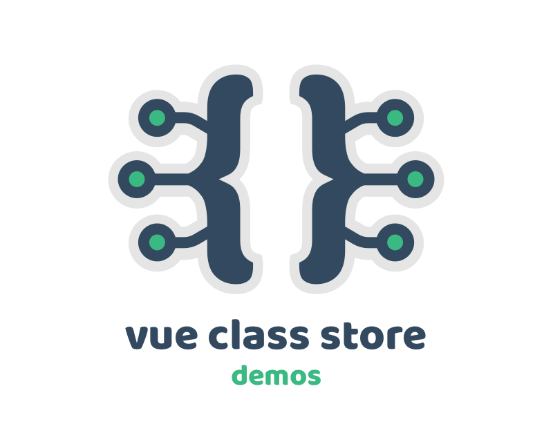

## Vue Class Store - Demos

> Vue Class Store demos for Vue 2, Vue 3 and Nuxt



## Abstract

This repo provides demos for [Vue Class Store](https://github.com/davestewart/vue-class-store) for Vue 2, Vue 3 and Nuxt.

Each of the demos shows core Vue Class Store functionality in comparison to alternate state management functionality:

Class Store:

- [Basic Class Store](vue-2/src/examples/class-store/basic)
- [Inline Class Store](vue-2/src/examples/class-store/inline)
- [Class Store with Inheritance](vue-2/src/examples/class-store/inherit)
- [Global Class Store](vue-2/src/examples/class-store/global)

Alternatives:

- [Vue Component](vue-2/src/examples/other/vue-component)
- [Vue Model](vue-2/src/examples/other/vue-model)
- [Vuex](vue-2/src/examples/other/vuex)


## Setup

To run the demos, simply CD into each folder, install and run, i.e.:

```
cd vue-2
npm i
npm run demo
```

## Demos

Each demo example uses a single methodology to model a rectangle with the following common functionality:

- Width and height props / parameters
- Computed / getter area property
- A watch on the area property
- A logs property and log method
- A randomize method

Look in the `<demo>/src/examples/*` folder to compare the code, or open the debugger Sources panel to see it in action.

Make sure to check both the view and the model files within each!

## A note about local development and symlinks

In order for Vue Class Store to work correctly, the package Vue and the project Vue must be the same Vue.

Because of Node's module resolution rules, if you symlink the package rather than NPM installing it, Node will load two different Vues for the project and package.

To fix this, you need to tell the project's webpack setup to use only the project's Vue: 

```js
const path = require('path')

// vue.config.js
module.exports = {
  chainWebpack: (config) => {
    config.resolve.symlinks(false)
    config.resolve.alias.set('vue$', path.resolve(__dirname, 'node_modules/vue/'))
  }
}
```

This is already set up in each of the demos, but good to know.
